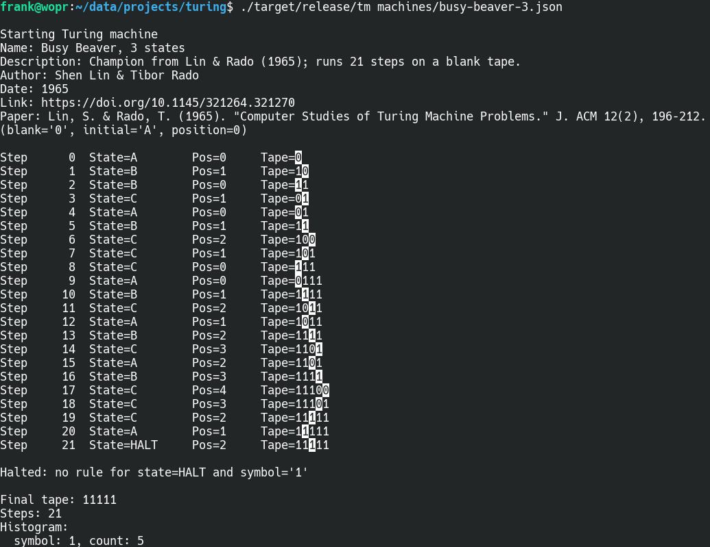

# Turing Machine Simulator in Rust

This repository contains a Rust command-line tool that simulates Turing machines described in a JSON format. The simulator prints every step of the computation or, when run with `--fast`, print only every 100,000 steps.

## Building and Running

1. **Install Rust** (version 1.81+ recommended) and Cargo.
2. **Clone** (or copy) this repository.
3. In the repository directory, run:

    ```bash
    cargo build --release
    ```
    This compiles the simulator with optimizations.

4. **Run** the simulator on a JSON file:
    ```bash
    ./target/release/tm mymachine.json
    ```
    This will print **every** step.

5. Alternatively, run in **fast mode**:
    ```bash
    ./target/release/tm --fast mymachine.json
    ```
    This prints only once per 100,000 steps.

## JSON Format

The JSON format for the Turing machines is based on [David Eck's](https://math.hws.edu/eck/js/turing-machine/TM-info.html) format, and all his example machines are also included in the `machines` folder. But I omitted `max_state` and `symbols`, because it is redundant. And it is in JSON5 format, which allows comments. It must contain these fields:

- **`blank`** (string, **mandatory**): The symbol representing a blank cell (e.g. `"0"` or `"#"`).
- **`initial`** (string, **mandatory**): The initial state of the machine (e.g. `"A"`).
- **`transitions`** (array, **mandatory**): Each element is `[ oldState, oldSymbol, newSymbol, direction, newState ]`.
  - **`oldState`**: The current state.
  - **`oldSymbol`**: The tape symbol under the head; can be a single character or multiple characters to match any of them. If the machine sees no matching symbol, it checks `(oldState, "*")` as a wildcard.
  - **`newSymbol`**: Symbol to write onto the tape; if this is `"*"`, it means "rewrite the same symbol." Must be a single character or the wildcard.
  - **`direction`**: `"L"` for move left, `"R"` for move right, or `"S"` for don't move.
  - **`newState`**: The new state. `"*"` uses the same old state.

### Optional Fields

- **`name`** (string): Name/title of the machine.  
- **`description`** (string): Brief notes about its function.  
- **`author`** (string): Creator or discoverer of the machine.  
- **`date`** (string): Year/date of publication.  
- **`link`** (string): Webpage for more info.  
- **`paper`** (string): Full citation reference.  
- **`tape`** (string): Initial tape contents. If absent or empty, the tape starts blank.
- **`position`** (integer): Head position at the start (default 0).

If, at any point, the machine finds **no** applicable rule for `(currentState, currentSymbol)`, it halts. Or if it transitions to a special state like `"HALT"` that has no rules, it halts on the next step.

## Examples

In the `machines` folder, you'll find JSON files for several Turing machines, for example Busy Beaver 3:



The 47 millions steps of Busy Beaver 5 need about 7 seconds on my PC:
```
time ./target/release/tm --fast machines/busy-beaver-5.json
...
Steps: 47176870
Number of transitions: 10
Histogram:
  symbol: 0, count: 8191
  symbol: 1, count: 4098

real    0m7.167s
user    0m6.374s
sys     0m0.016s
```
